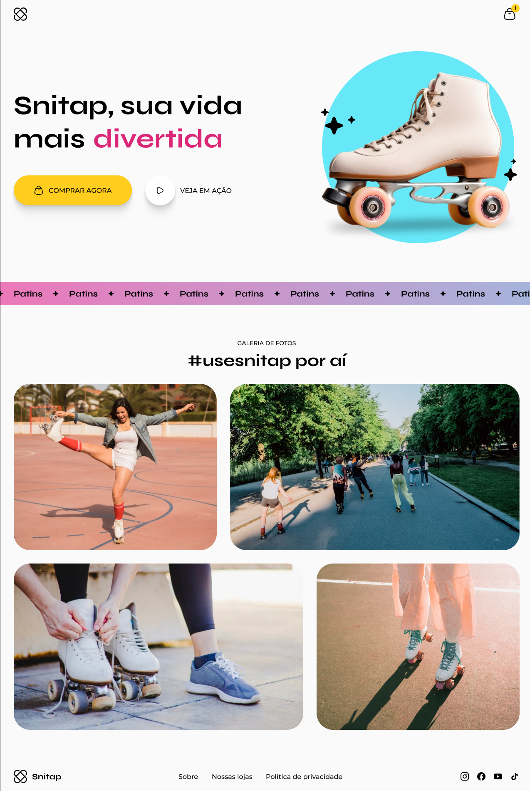

# Snitap

___

Uma **landing page moderna e envolvente** que utiliza transições e animações avançadas em CSS para proporcionar uma experiência visual impactante. Este projeto é ideal para demonstrar habilidades em design responsivo e estilização criativa com CSS.

---

## Sobre o Projeto

O **Snitap** foi criado com o objetivo de explorar o potencial das animações e transições em CSS, focando em proporcionar uma interação suave e atraente para os usuários. A página combina um layout elegante com efeitos dinâmicos que capturam a atenção e deixam a navegação mais envolvente.

---

## Funcionalidades e Destaques

- **Transições Suaves:** Elementos interativos com efeitos de transição que melhoram a experiência do usuário.
- **Animações Personalizadas:** 
  - Destaque em botões, imagens e seções específicas.
  - Animações criadas para dar vida ao conteúdo e capturar o interesse visual.
- **Design Responsivo:** Compatível com diferentes dispositivos e tamanhos de tela.
- **Estrutura Clean:** Foco em clareza e simplicidade, permitindo fácil personalização.
- **Figma como Referência:** Layout planejado e alinhado com o design original no Figma.

---

## Tecnologias Utilizadas

- **HTML5:** Para a estrutura semântica da página.
- **CSS3:** Para estilização, transições e animações.
- **Figma:** Utilizado como base para o design e prototipagem do projeto.

---

## Demonstração do Projeto

Veja abaixo uma prévia do layout criado no Figma:

---

Feito com :heart: por Tiago Marques.
